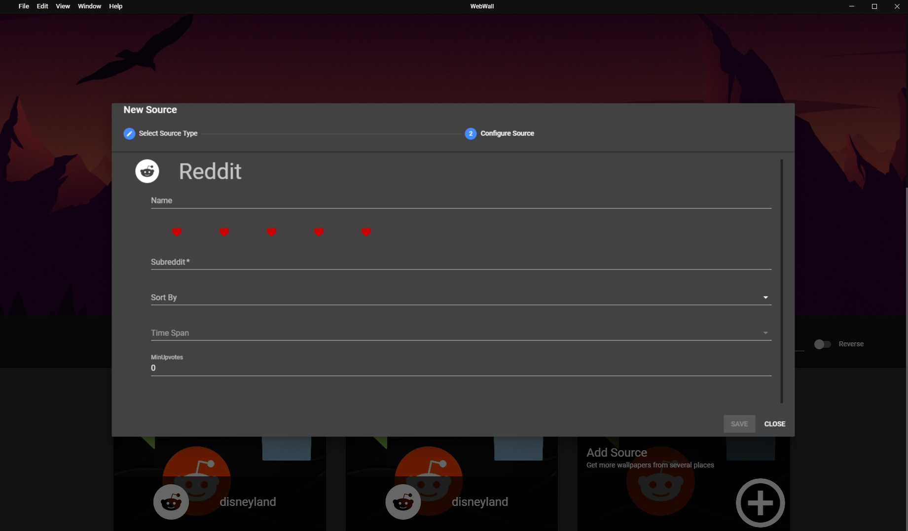
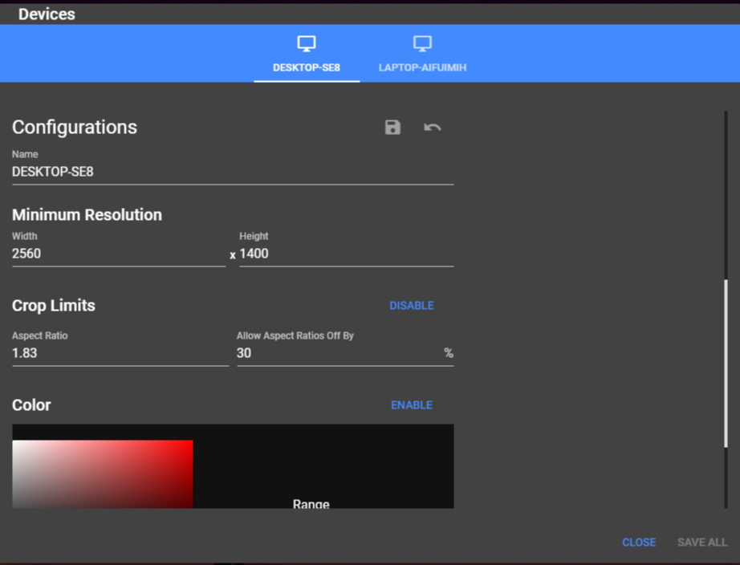

# Web Wallpaper
Update your desktop wallpaper with images from Reddit, Google Photos, or your local files every morning. Of course, we want to make sure the images we're getting match our device's resolution and we can specify if images that include faces or text are used.

## Getting Started
In order to set up the back end, you'll need to make sure you've provided [credentials](https://cloud.google.com/docs/authentication/getting-started) to a [firebase](https://firebase.google.com/) project with [Cloud Vision](https://cloud.google.com/vision), [Firestore](https://firebase.google.com/docs/firestore), [Cloud Functions](https://firebase.google.com/docs/functions), and [Authentication](https://firebase.google.com/docs/auth/web/google-signin) enabled.

Enter the firebase folder in [{PROJECT_ROOT}/firebase](./firebase) and deploy the cloud functions using the command: `firebase deploy --only functions` .  You can also test these functions before deployment by running `npm test` in [{PROJECT ROOT}/firebase/functions](./firebase/functions).  These test will populate your Firestore with test collections due to the difficulty in mocking the database API.

Furthermore, you'll need to limit users data privelages by pushing firestore rules: `firebase deploy --only firestore:rules`

Now that your back end is setup, enter the front end folder at [{PROJECT_ROOT}/web_wallpaper](./web_wallpaper). The front end runs on [electron](https://github.com/electron/electron) and [electron-vue](https://github.com/SimulatedGREG/electron-vue).  Install these and other dependencies by running `npm install` in the front end directory.  To launch the electron app use `npm run dev`

## Functionality
Source Configuration            |  Device Configuration
:-------------------------:|:-------------------------:
  |  

There are two major components to the app: sources and devices.  Sources are places where images are pulled from.  Subreddits, Google Photo Albums, and local files are all potential sources and each one has a unique configuration.  Devices are laptops, desktops, and (later) phones that you've used the app on.  Different devices can specify restrictions on resolution, aspect ratio, and background color while using global sources.

## Electron App WIP
#### Device Configurations
- [ ] Wallpaper carousel
- [X] Minimum Resolution
- [X] Aspect Ratio Config
- [X] Color Filters
#### Home Page
- [X] Source Cards
- [ ] Wallpaper carousel
#### Source Configurations
- [ ] Image carousel
- [ ] Face and text filtering
- [X] Show different configuration types
- [ ] Exclude devices
#### Reddit
- [ ] Add missing subreddit sorting options (random, hot, etc.)
#### Google Photos
- [ ] Select person, album, or place
- [ ] Authenticate with API (after login)
#### Background Service
- [ ] Pull image from database every morning
- [ ] Handle wallpaper updates from electron
- [ ] Prompt on expired credentials

## Serverless Back End WIP
- [X] Tests
- [X] Update wallpapers for all users
- [ ] Cleanup expired data
- [ ] Handle user deletion
- [ ] Color filters
- [ ] Google Photos
- [ ] Local files